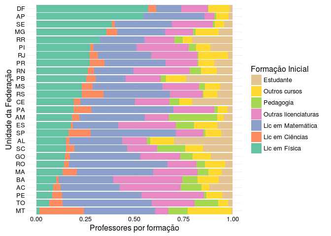
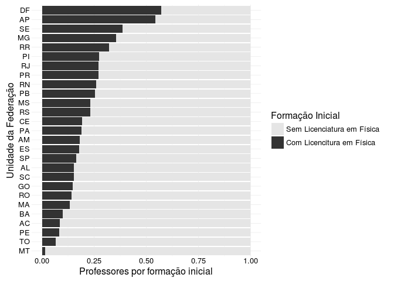

# Os professores de Física
André Rodrigues  
07/02/2016  

## Formação inicial dos professores de Física

Considerando a totalidade dos professores que lecionam Física, podemos ver que apenas 11011 (19.58%) possuem licenciatura em Física. A formação do professor de Física é claramente uma questão importante para compreender um o baixo desempenho dos estudantes. Atualmente o país conta com 56241 professores que lecionam a disciplina de Física. Atualmente o maior grupo é formado pelos professores com licenciatura em Matemática compondo 18626 (33.12%) dos professores. Curiosamente, do grupo de professores licenciados em Matemática 12724 (68.31%) não lecionam Matemática lecionando apenas Física e outras disciplinas. A tabela (tabela 1) abaixo possibilita uma melhor visualização sintética dessa questão em âmbito nacional.

|   Formação inicial   | Número | Porcentagem (%) |
|:--------------------:|:------:|:---------------:|
|    Lic em Física     | 11011  |      19.58      |
|   Lic em Ciências    |  3821  |      6.79       |
|  Lic em Matemática   | 18626  |      33.12      |
| Outras licenciaturas | 10960  |      19.49      |
|      Pedagogia       |  2071  |      3.68       |
|    Outros cursos     |  5366  |      9.54       |
|      Estudante       |  4386  |      7.80       |

> ###### Fonte: MEC/INPE - Censo Escolar/2014

Quando observamos essa distribuição por estado vemos que em diversos estados a situação é ainda mais crítica, possuindo um número de licenciados muito abaixo da média nacional.
 

Gráfico 1. Distribuição percentual de professores por formação inicial

> ###### Fonte: MEC/INPE - Censo Escolar/2014

Diversos estados fazem uso ainda mais intenso de professores formados em Matemática e mesmo estados que concentram o maior número de professores, como é o caso do estado da Bahia com 4008 professores de Física, tem um número de licenciados em Física muito abaixo da média nacional com apenas 10%. A presença dos licenciados em Física fica mais evidente no gráfico 2, em que destacamos apenas os professores que tem ou não licenciatura em Física.

 

Gráfico 2. Distribuição percentual de professores por formação inicial

> ###### Fonte: MEC/INPE - Censo Escolar/2014

## Formação em Pós-Graduação

Além da formação inicial do professor de Física é importante ter clareza formação continuada do professor, em particular sobre a formação em pós-graduação. Como consta na [meta 16 do PNE](http://pne.mec.gov.br/images/pdf/pne_conhecendo_20_metas.pdf#12), 

> Meta 16: formar, em nível de pós-graduação, 50% (cinquenta por cento) dos professores da educação básica, até o último ano de vigência deste PNE, (...)

A formação do corpo docente em nível de pós-graduação está dentre as prioridades educacionais. A maior parte dos professores de Física não possuem nenhum tipo de formação em pós-graduação. Cerca de 42.65% dos professores possuem esse tipo de formação. A tabela a seguir mostra a distribuição dos professores por formação inicial e por formação em pós-graduação. Nesse caso somam-se aqueles que possuem `especialização`, `mestrado` ou `doutorado`. 

+----------------------------+-------------------------+-----------+
|          &nbsp;\           |  Possui pós-graduação\  |  &nbsp;\  |
|      Formação inicial      |           sim           |    não    |
+============================+=========================+===========+
|    **Lic em Física**\      |        &nbsp;\          | &nbsp;\   |
|            N\              |         3305\           |  5327\    |
|         Column(%)          |         17.95%          |  21.51%   |
+----------------------------+-------------------------+-----------+
|   **Lic em Ciências**\     |        &nbsp;\          | &nbsp;\   |
|            N\              |         1135\           |  1376\    |
|         Column(%)          |          6.16%          |   5.56%   |
+----------------------------+-------------------------+-----------+
|  **Lic em Matemática**\    |        &nbsp;\          | &nbsp;\   |
|            N\              |         5711\           |  7814\    |
|         Column(%)          |         31.02%          |  31.56%   |
+----------------------------+-------------------------+-----------+
| **Outras licenciaturas**\  |        &nbsp;\          | &nbsp;\   |
|            N\              |         3640\           |  5251\    |
|         Column(%)          |         19.77%          |  21.21%   |
+----------------------------+-------------------------+-----------+
|      **Pedagogia**\        |        &nbsp;\          | &nbsp;\   |
|            N\              |         834\            |  1155\    |
|         Column(%)          |          4.53%          |   4.66%   |
+----------------------------+-------------------------+-----------+
|    **Outros cursos**\      |        &nbsp;\          | &nbsp;\   |
|            N\              |         1296\           |  2732\    |
|         Column(%)          |          7.04%          |  11.03%   |
+----------------------------+-------------------------+-----------+
|      **Estudante**\        |        &nbsp;\          | &nbsp;\   |
|            N\              |         2491\           |  1108\    |
|         Column(%)          |         13.53%          |   4.47%   |
+----------------------------+-------------------------+-----------+
|           Total\           |         18412\          |  24763\   |
|                            |         42.65%          |  57.35%   |
+----------------------------+-------------------------+-----------+

Table: Tabela 2. Distribuição dos professores de Física por formação inicial e cursos de pós-graduação. (continued below)

 

+-----------+
|  &nbsp;\  |
|   Total   |
+===========+
| &nbsp;\   |
|   8632\   |
+-----------+
| &nbsp;\   |
|   2511\   |
+-----------+
| &nbsp;\   |
|  13525\   |
+-----------+
| &nbsp;\   |
|   8891\   |
+-----------+
| &nbsp;\   |
|   1989\   |
+-----------+
| &nbsp;\   |
|   4028\   |
+-----------+
| &nbsp;\   |
|   3599\   |
+-----------+
|  43175\   |
+-----------+

> ###### Fonte: MEC/INPE - Censo Escolar/2014

|                     | pos  |   %   | mestrado |   %   | doutorado |   %   |
|:--------------------|:----:|:-----:|:--------:|:-----:|:---------:|:-----:|
|Lic em Física        | 3305 | 17.95 |   695    | 45.37 |    124    | 51.24 |
|Lic em Ciências      | 1135 | 6.16  |    56    | 3.66  |     8     | 3.31  |
|Lic em Matemática    | 5711 | 31.02 |   216    | 14.10 |    24     | 9.92  |
|Outras licenciaturas | 3640 | 19.77 |   264    | 17.23 |    25     | 10.33 |
|Pedagogia            | 834  | 4.53  |    6     | 0.39  |     0     | 0.00  |
|Outros cursos        | 1296 | 7.04  |   288    | 18.80 |    60     | 24.79 |
|Estudante            | 2491 | 13.53 |    7     | 0.46  |     1     | 0.41  |

> ###### Fonte: MEC/INPE - Censo Escolar/2014

